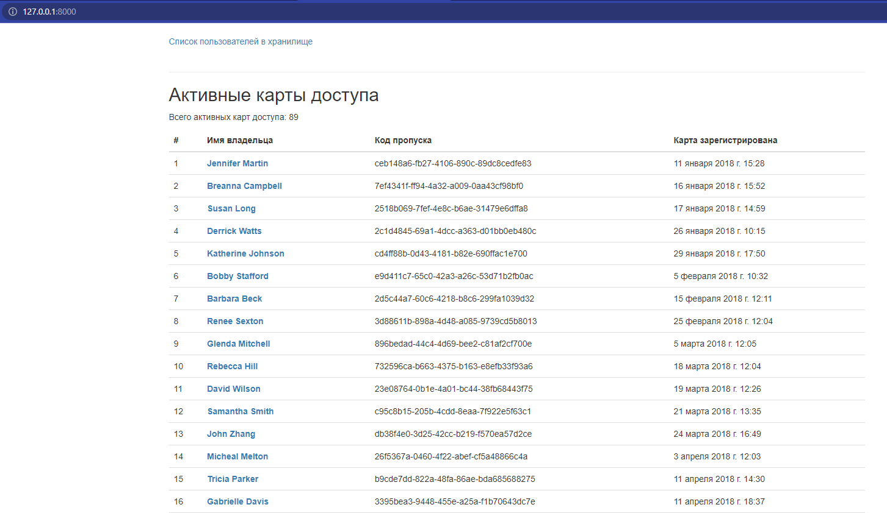

# Security console

Сontrol panel that displays lists of visits.

- Сlone this repository:
```bash
git clone git@github.com:MaxHC-vlop/bank_security_console.git
```

 - You must have python3.9 (or higher).

 - Create a virtual environment on directory project:
 ```bash
python -m venv env
 ```
- Start the virtual environment:
```bash
. env/bin/activate
```
- Then use pip to install dependencies:
```bash
pip install -r requirements.txt
```
- Create a file in the project directory `.env` :
```bash
touch .env
```
- Create variables in the `.env` file, fill them with database settings, and select debug mode :

```
DB_HOST='your_host'
DB_PORT='your_port'
DB_NAME='your_name'
DB_USER='your_user'
DB_PASSWORD='your_passwod'
DB_DEBUG=`true or false`
SECRET_KEY=`your_secret_key`
ALLOWED_HOSTS=[`your_domain_1`, `your_domain_2`, ...]
```

## Run

```bash
python manage.py runserver 0.0.0.0:8000
```
- You will see :
```
Performing system checks...

System check identified no issues (0 silenced).
November 11, 2022 - 01:16:53
Django version 3.2.16, using settings 'project.settings'
Starting development server at http://0.0.0.0:8000/
Quit the server with CONTROL-C.
```
- Entered ad http://127.0.0.1:8000/ and see :

